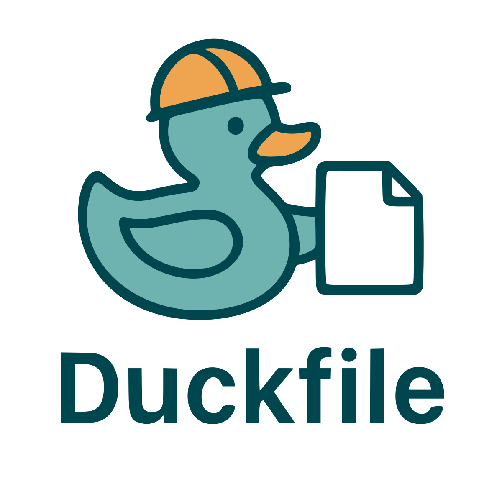

<!-- Badges -->
[](https://github.com/CyberDuck79/duckfile/actions/workflows/ci.yml)
[](https://coveralls.io/github/CyberDuck79/duckfile?branch=main)
[](https://pkg.go.dev/github.com/CyberDuck79/duckfile)
[](https://goreportcard.com/report/github.com/CyberDuck79/duckfile)
[](LICENSE)


# Duckfile
Universal remote templating for DevOps tools

Duckfile lets you keep your Makefiles, Taskfiles, Helm values, and other config as remote templates, render them locally with variables, and run the tool seamlessly.

## Features
- Git-sourced templates: repo + ref + path
- Variable tags: !env, !cmd, !file, and literals
- Target descriptions + `duck list` for discoverability
- Go templates with Sprig functions
- Custom delimiters to avoid collisions (e.g., Taskfile)
- Deterministic caching with stable symlinks
- Checksum validation of remote templates
- **Commit hash tracking and validation for reproducible builds**
- **Host allow/deny lists for supply-chain security**
- Simple CLI that forwards args to your tool (make, task, helm, …)
- Render-only workflow via `duck sync` when you don't want `duck` to execute your tools

## Install
```sh
go install github.com/CyberDuck79/duckfile/cmd/duck@latest
```

Go 1.24.0+ recommended.

## Quick start
1) Create duck.yaml at the repo root:
```yaml
version: 1

default: build

targets:
  build:
    binary: make
    fileFlag: -f
    template:
      repo: https://github.com/CyberDuck79/duckfile-test-templates.git
      ref: main
      path: Makefile.tpl
      checksum: "e3b0c44298fc1c149afbf4c8996fb92427ae41e4649b934ca495991b7852b855"
      trackCommitHash: true        # Track commit changes
      autoUpdateOnChange: true     # Auto-update when changed
    variables:
      PROJECT: my-service
      DATE: !cmd date +%Y-%m-%d
    renderedPath: Makefile

  test:
    binary: task
    fileFlag: --taskfile
    template:
      repo: https://github.com/CyberDuck79/duckfile-test-templates.git
      ref: v2.3.3
      path: task/Taskfile.yml.tpl
      delims: { left: "[[", right: "]]" }  # avoid Task's {{ }}
      allowMissing: true                   # missing vars => ""
      trackCommitHash: true                # Track tags for updates
    variables:
      GO_VERSION: !env GO_VERSION
      PLATFORM: linux/amd64
    args: ["--silent"]

  docs:
    # No binary: this target is sync-only. Use `duck sync docs` to render.
    template:
      repo: https://github.com/CyberDuck79/duckfile-test-docs-templates.git
      ref: main
      path: index.md.tpl
    variables:
      AUTHOR: Cyberduck
```

2) Run
```sh
# print version
duck version

# run default target (renders Makefile and calls make -f Makefile)
duck

# run a named target and pass additional args after --
duck test --

# list targets (names, binaries, descriptions)
duck list
# include remote info / variable kinds / execution line
duck list -rve

# render-only workflows (no binary execution)
# sync all targets into cache and update symlinks
duck sync
# force re-render ignoring cache
duck sync -f
# clean cache for all or a single target
duck clean
duck clean test

# verbosity / debugging
# show high-level steps (render, cache hits, pruning, exec line)
duck --log-level=info
# extremely detailed (includes variable values, paths, clone steps)
duck --log-level=debug
duck sync --log-level=debug   # set log level for subcommands

# commit hash tracking and validation
# enable tracking with manual updates (warns about changes)
duck build --track-commit-hash
# enable tracking with automatic updates (transparent updates)  
duck sync --track-commit-hash --auto-update-on-change
# disable tracking entirely (backward compatible)
duck --no-track-commit-hash build
```

## Security Features

Duckfile includes supply-chain security features to prevent malicious template injection:

### Host Allow/Deny Lists
Control which Git hosts can be accessed for templates. Security configurations are kept **separate from `duck.yaml`** to prevent attackers from modifying both targets and security policies together.

**Configuration Precedence** (highest to lowest):
1. **CLI Flags** - Override everything else
2. **Environment Variables** - System-level defaults  
3. **No Restrictions** - Allow all hosts (default)

```bash
# CLI flags (highest precedence)
duck build --allowed-hosts github.com,gitlab.internal.com
duck sync --denied-hosts malicious-host.com --strict-hosts

# Environment variables (system-level)
export DUCK_ALLOWED_HOSTS="github.com,gitlab.internal.com"
export DUCK_DENIED_HOSTS="malicious-host.com" 
export DUCK_STRICT_MODE="true"  # Fail if no restrictions configured

# Then run any duck command
duck build
duck sync
```

**Security Rules:**
- **Deny beats allow**: Denied hosts are blocked even if in allow list
- **Strict mode**: Fail if no restrictions are configured  
- **Fast validation**: Host checking happens before git operations
- **Case insensitive**: `GitHub.COM` matches `github.com`

See the [security schema](docs/security.schema.json) and [full specification](docs/spec.md) for complete details.

## Commit Hash Validation

Duckfile can track and validate commit hashes to detect when remote templates change, ensuring reproducible builds and providing early warning of template updates.

### Basic Usage

**Configuration in `duck.yaml`:**
```yaml
targets:
  build:
    template:
      repo: https://github.com/example/templates.git
      ref: main  # Use branch/tag names, not commit hashes
      path: Makefile.tpl
      trackCommitHash: true        # Enable tracking
      autoUpdateOnChange: true     # Auto-update when commits change

# Or set globally in settings
settings:
  trackCommitHash: true
  autoUpdateOnChange: false  # Manual updates by default
```

**CLI flags override configuration:**
```bash
# Enable tracking with manual updates
duck build --track-commit-hash

# Enable tracking with automatic updates
duck sync --track-commit-hash --auto-update-on-change

# Disable tracking entirely
duck --no-track-commit-hash build
```

**Environment variables for system-wide defaults:**
```bash
export DUCK_TRACK_COMMIT_HASH="true"
export DUCK_AUTO_UPDATE_ON_CHANGE="true"
duck build  # Uses environment settings
```

### How It Works

**First Run (tracking enabled):**
1. Fetches template from `repo@ref`
2. Resolves branch/tag to actual commit hash
3. Stores commit hash alongside cached template
4. Renders and executes normally

**Subsequent Runs:**
1. Checks if remote commit hash has changed
2. **Without auto-update**: Warns about changes, uses cached template
3. **With auto-update**: Automatically re-fetches and updates cache

### Configuration Precedence

Settings are resolved in this order (highest to lowest priority):

1. **CLI flags**: `--track-commit-hash`, `--no-track-commit-hash`, `--auto-update-on-change`, `--no-auto-update-on-change`
2. **Environment variables**: `DUCK_TRACK_COMMIT_HASH`, `DUCK_AUTO_UPDATE_ON_CHANGE` 
3. **Template config**: `template.trackCommitHash`, `template.autoUpdateOnChange`
4. **Global config**: `settings.trackCommitHash`, `settings.autoUpdateOnChange`
5. **Default**: `false` (disabled)

### Example Workflows

**Development (auto-update enabled):**
```bash
# Templates update automatically as upstream changes
duck build --track-commit-hash --auto-update-on-change
# Output: "📦 Updating template cache: repo@main" (if changed)
```

**Production (manual updates):**
```bash
# Get warned about changes but continue with cached template
duck build --track-commit-hash --no-auto-update-on-change  
# Output: "🔄 commit hash changed for repo@main: abc123 -> def456"
```

**Strict reproducibility (tracking disabled):**
```bash
# Use exact commit hashes in config, disable tracking
duck build --no-track-commit-hash
# Template ref: "a1b2c3d4e5f6..." (40-char commit hash)
```

### Validation Rules

- **Branch/tag only**: Commit hash tracking requires `ref` to be a branch or tag name, not a commit hash
- **Auto-update dependency**: `autoUpdateOnChange` requires `trackCommitHash` to be enabled
- **Network resilience**: Network failures during validation result in warnings, not errors
- **Fast feedback**: Remote checking happens before expensive git operations

## Logging Configuration

Control verbosity with log levels, configured via CLI flag, environment variable, or config file.

**Precedence** (highest to lowest):
1. CLI flag: `--log-level=debug`
2. Environment variable: `DUCK_LOG_LEVEL=info`
3. Config file: `settings.logLevel: warn`
4. Default: `info`

**Log Levels** (from least to most verbose):
- `error`: Only critical errors
- `warn`: Warnings and errors 
- `info`: High-level steps (default)
- `debug`: Detailed debugging information

**Examples:**
```sh
# Set via CLI flag (highest precedence)
duck --log-level=debug build
duck sync --log-level=warn

# Set via environment variable
export DUCK_LOG_LEVEL=debug
duck build

# Set via config file (duck.yaml)
settings:
  logLevel: info
```

## How it works (MVP)
- Resolve variables:
  - !env NAME → os.Getenv(NAME)
  - !cmd SHELL → /bin/sh -c SHELL (trimmed)
  - !file PATH → file contents
  - literal scalars (string/number/bool)
- Deterministic caching:
  - key = SHA1(repo + ref + path + resolvedVarsJSON)
- if the cache key is new, clone/fetch the template repo at the requested ref.
- Render the template using Go text/template + Sprig.
- rendered file stored under .duck/objects/<key>/<basename>
- a symlink at renderedPath (or .duck/<target>/<basename>) points to the object
- Execute the tool: binary fileFlag renderedPath [args …]
- Or use `duck sync` for render-only workflows (no `binary` required)

## Templating tips
- Use Sprig to transform values: {{ .PROJECT | upper }}
- Add now/env helpers: {{ now }} and {{ env "HOME" }}
- When the generated file itself uses Go templates (e.g., Taskfile), set `delims` so our engine renders only your placeholders and leaves the downstream engine’s `{{ ... }}` intact.
- If you want missing variables to become empty strings, set `allowMissing: true`. Default is strict.

## Project layout
| Path | Purpose |
|---|---|
| `cmd/` | Entry point (`main.go`) |
| `cmd/duck/` | Cobra command (`root.go`) |
| `internal/config/` | Parser for `duck.yaml` |
| `internal/git/` | Git wrapper for clone/fetch/checkout |
| `internal/run/` | Render + cache + exec |

## Troubleshooting
- git exit status 128: usually wrong ref or network; error message includes git’s stderr.
- “map has no entry …” during rendering: you are missing a variable and `allowMissing` is false, or your delimiters collide with the target tool (set `delims`).
- On macOS, if a symlink isn’t resolving, remove it and re-run; Duck recreates it.

## Spec
See the full specification: [docs/spec.md](docs/spec.md)

## Using Duckfile without executing tools
If you prefer Duckfile to only manage templates and never launch external binaries, omit `binary` from your targets. You can then:
- `duck sync [target] [-f]` to render and refresh symlinks
- `duck clean [target]` to purge caches

If a target has no `binary`, attempting to execute it via the root command will error with guidance to use `sync` instead.
